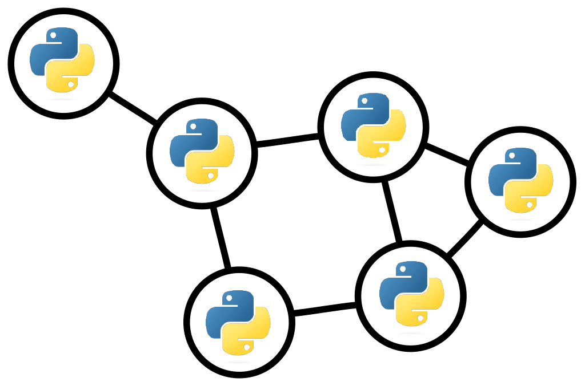

# The Definite Guide to Graph Problems 

<div align="center">
  

  
  

</div>

This repository contains exercises from [The Definite Guide to Graph Problems](https://www.giulianopertile.com/blog/the-definitive-guide-to-graph-problems/).

To read the article, click the following link 👉 [The Definite Guide to Graph Problems](https://www.giulianopertile.com/blog/the-definitive-guide-to-graph-problems/)

## Purpose of this Project

[The Definite Guide to Graph Problems](https://www.giulianopertile.com/blog/the-definitive-guide-to-graph-problems/) was created to help people solve graph problems in order to succeed in coding interviews, as well as to improve problem solving skills.

## Run the Problems

1. Clone the repo
```bash
git clone https://github.com/francofgp/The-Definite-Guide-to-Graph-Problems
cd The-Definite-Guide-to-Graph-Problems/
```

2. This project requieres no external dependencies. To run the files just `cd` into the folder that you want and run the following

```bash
python '.\Adjacency List as my Graph representation.py'
```

## How to contribute

Pull requests are welcome. For major changes, please open an issue first to discuss what you would like to change.

Currently the solutions are written in python, feel free to include solutions in other programming languages of your interest.

## [License](#license)

Closures is provided under the [MIT License](https://github.com/vhesener/Closures/blob/master/LICENSE).

```text
MIT License

Copyright (c) 2022 Pértile Franco Giuliano

Permission is hereby granted, free of charge, to any person obtaining a copy of this software and associated documentation files (the "Software"), to deal in the Software without restriction, including without limitation the rights to use, copy, modify, merge, publish, distribute, sublicense, and/or sell copies of the Software, and to permit persons to whom the Software is furnished to do so, subject to the following conditions:

The above copyright notice and this permission notice shall be included in all copies or substantial portions of the Software.

THE SOFTWARE IS PROVIDED "AS IS", WITHOUT WARRANTY OF ANY KIND, EXPRESS OR IMPLIED, INCLUDING BUT NOT LIMITED TO THE WARRANTIES OF MERCHANTABILITY, FITNESS FOR A PARTICULAR PURPOSE AND NONINFRINGEMENT. IN NO EVENT SHALL THE AUTHORS OR COPYRIGHT HOLDERS BE LIABLE FOR ANY CLAIM, DAMAGES OR OTHER LIABILITY, WHETHER IN AN ACTION OF CONTRACT, TORT OR OTHERWISE,ARISING FROM, OUT OF OR IN CONNECTION WITH THE SOFTWARE OR THE USE OR OTHER DEALINGS IN THE
SOFTWARE.
```


[MIT](https://choosealicense.com/licenses/mit/)


